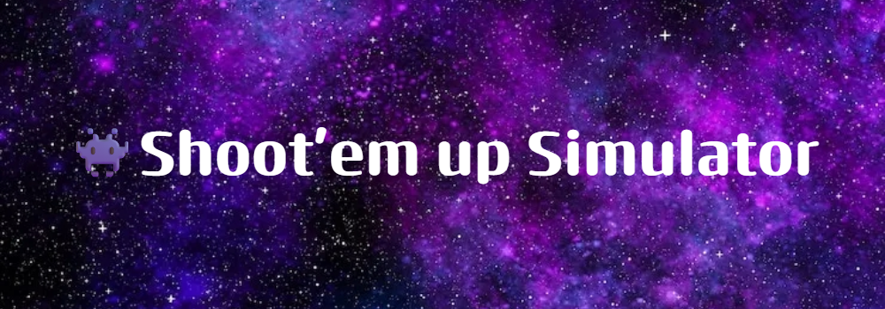

## Sobre
```bash
O 'piupiu' é um simulador do gênero "Shoot 'em up".
Seu objetivo é deduzir qual jogador alcançará 20 pontos primeiro.
```


## Instalação Necessária

Instalação de pacotes necessários via [pip](https://pip.pypa.io/en/stable/).

```bash
pip3 install pygame
pip3 install flask
pip3 install flask_sqlalchemy
pip3 install flask_cors
```

## Estrategias
```bash
Para alcançar os 20 pontos, os jogadores possuem 
diferentes estrategias de movimentação e tiro:

- 1: Movimentação randomizada.
- 2: De uma ponta à outra.
```

## Inserir Imagens de Obstáculos por rota de upload:

```bash
-Inicie o arquivo 'ex_backend'
-Abra o terminal do seu computador
-Escreva: curl -i -X POST -F files=@imagem.png http://127.0.0.1:5000/upload
-Em que @imagem.png corresponde ao arquivo a ser adicionado
-Inicie o jogo no arquivo 'jogo.py'
-Digite 'sim' no terminal do python para personalizar os obstaculos
-Digite o nome do arquivo
-Exemplo: tohou.png
-Obs: As imagens de obstaculos vão para a pasta de 'inimigos'
```

## Atualizações:
*Versão 1.2:
```bash
-Exclusão de imagens fora da pasta de imagens C:
-Inclusão do arquivo .gitignore
-Importação de diversas classes via __all__ em modulo
-Classe Player,Player2 movida a um arquivo exclusivo
-Objetos em pasta separada
-Criação da pasta "web" para arquivos html e javascript
-Inclusão da rota de upload para imagens
-Criação da pasta 'objetos' para instâncias de classes
-Upload de arquivos
-Obstáculos possuem imagens
```

## Créditos
```bash
Musica de fundo:
https://opengameart.org/content/nes-shooter-music-5-tracks-3-jingles

Efeitos sonoros:
https://opengameart.org/content/8-bit-sound-effects-library
Attribute Little Robot Sound Factory, and provide this link where possible: www.littlerobotsoundfactory.com
```
#https://www.makeareadme.com/
